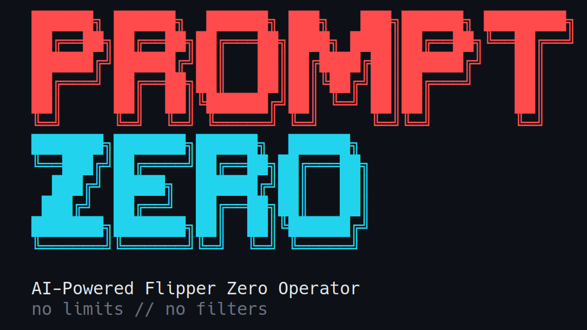
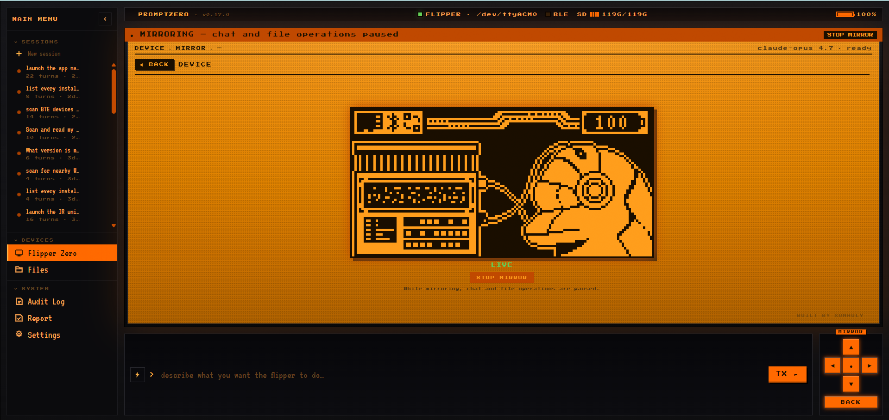

<p align="center">
  
</p>

<p align="center">
  <a href="https://github.com/xunholy/promptzero/releases/latest"></a>
  <a href="https://github.com/xunholy/promptzero/blob/main/LICENSE"></a>
  <a href="https://github.com/xunholy/promptzero/actions/workflows/ci.yaml"></a>
  <a href="scripts/claude-usage.py"></a>
</p>

<sub align="center">_Claude usage/cost is an estimate aggregated from the maintainer's local Claude Code transcripts (`task claude-usage`); it reflects this machine's sessions only._</sub>

> **Describe it. Generate it. Deploy it. Run it.**

PromptZero is a natural-language operator for the [Flipper Zero](https://flipperzero.one). Talk to it like you'd talk to a person — it generates payloads, deploys them, and runs them, all from a single sentence.

> [!CAUTION]
> **Authorised use only.** PromptZero generates and runs RF, NFC, RFID, and HID payloads — illegal outside contexts you own or have written authorisation to test. Read [`SECURITY.md`](SECURITY.md) for the safety model and threat boundary. The project is under active development; APIs and tools change between minor versions.
>
> *Built end-to-end with [Claude](https://claude.ai). Review generated payloads before deployment.*

```
promptzero> make me a Starbucks WiFi captive portal
  Generated and deployed evil_portal to /ext/apps_data/evil_portal/index.html
  Evil portal started on Marauder devboard

promptzero> scan for nearby WiFi networks and deauth the strongest one
  Found 12 access points. Strongest: "NETGEAR-5G" (-31 dBm, channel 6)
  Selected AP 0. Deauth attack running...

promptzero> create a BadUSB payload that opens a reverse shell on Windows
  Generated and deployed badusb to /ext/badusb/generated_payload.txt
  Ready to execute - plug into target and run

promptzero> identify this device: /tmp/remote.jpg
  That's a Samsung BN59 series TV remote using the Samsung32 IR protocol.
  I can generate a complete remote file. Want me to create it?
```

---

## Quick start

**Prerequisites** — Flipper Zero with modded firmware (Momentum / Unleashed / RogueMaster), an Anthropic API key, and a USB cable.

```bash
# 1. Install (Linux/macOS, amd64/arm64) — pinned to release artifacts (immutable per tag)
curl -fsSL https://github.com/xunholy/promptzero/releases/latest/download/install.sh | sh

# 2. Configure
export ANTHROPIC_API_KEY="sk-ant-..."

# 3. Run
promptzero
```

```
promptzero> what's connected?
  Flipper Zero — firmware 0.99.1, hardware v7.4
  Battery 84 % | SD card 4.1 GB free / 7.4 GB total
```

That's the whole onboarding. From here, type natural-language instructions or `/help` to see slash commands.

> **Defensive posture (one-flag safety rail):** add `--read-only` to refuse any tool that writes, transmits, or executes. Pure reads / scans / queries still dispatch; anything risk-Medium or above is refused at the boundary. See [Read-only safety rail](docs/reference/configuration.md#read-only-safety-rail) for the full rule.
>
> ```bash
> promptzero --read-only          # blue-team / forensics / training
> ```

**Other paths:** Windows users grab the `.zip` from the [releases page](https://github.com/xunholy/promptzero/releases). WSL2 needs USB passthrough — see [Transports → WSL2](docs/reference/transports.md#wsl2-usb-passthrough). For wireless BLE, config files, personas, environment variables, and self-upgrade: [Configuration reference](docs/reference/configuration.md).

---

## What it does

PromptZero connects to your Flipper Zero (and optional ESP32 Marauder WiFi devboard) over USB serial or BLE, then lets you control everything through natural language.

| Subsystem | Capabilities |
|---|---|
| **Flipper Zero** | Sub-GHz TX/RX, IR TX/RX, NFC detect/emulate, RFID read/write/emulate, iButton, GPIO, BadUSB, storage, app launcher |
| **ESP32 Marauder** | WiFi scan, deauth, beacon spam, probe flood, PMKID capture, evil portal, BLE spam, BT scanning, skimmer detection, wardriving, MAC spoofing |
| **AI Generation** | Evil portal HTML, BadUSB DuckyScript, Sub-GHz `.sub`, IR `.ir`, NFC `.nfc` from natural language — plus parametric builders for typed parameters |
| **Intelligence** | Image analysis via Claude vision (file path → device ID + attack vector), SD card discovery |
| **Audit** | SQLite audit log with MITRE ATT&CK technique tags, session export, statistics |

Run `promptzero` and type `/tools` for the live registry. Tool count grows release-over-release.

The **agent layer** ships prompt caching, cost-tier model routing (recon on Haiku / exploit on Opus), prompt-injection quarantine, reflexion-on-error with structured `ToolError`, a `<device-state>` oracle injected each turn, and OpenTelemetry GenAI spans. See [`docs/`](docs/) for architecture details.

---

## Modes

### CLI — `promptzero`

Default. Interactive REPL.

```
promptzero> scan the SD card and show me what signals I have saved
promptzero> transmit the garage door signal
promptzero> read the NFC tag on my desk
```

Slash commands (run `/help` for the full list with descriptions):

- **Conversation**: `/help`, `/reset`, `/quit`
- **Session**: `/sessions`, `/save <name>`, `/resume <id>`, `/forget <id>`
- **Info**: `/status`, `/tools [filter|page <n>]`, `/history [N]`, `/audit {stats|find|tail|top|session|query|export}`, `/stats [section]`, `/cost`, `/budget [set <USD>|off]`, `/debug`
- **Operator**: `/persona [name]`, `/mode [name]`, `/watch [pause|resume]`, `/webhooks [test <name>]`, `/validate <path>`, `/attack {set|clear} <techniques>`, `/campaign {validate|run} <file>`, `/rewind [snapshot]`, `/report [session] [json] [save]`, `/rules [list|pause|resume|test]`
- **Device**: `/reconnect`

Keystrokes during a turn:

- **Ctrl+C** — cancel the current turn entirely.
- **Ctrl+G** — abort the current streaming tool (e.g. `subghz_receive`, `wifi_scan_ap`) but let the agent continue with the partial result. Use this when you've seen what you needed and don't want to wait out the full duration.
- **Ctrl+R** — reverse-incremental history search.
- **Ctrl+L** — clear screen.

### Web UI — `promptzero --web`

Dark-themed browser interface at `http://localhost:8080`. Includes the chat surface, a live Flipper viewport, file browser, audit log, report builder, and (when a Marauder is connected) a TFT display panel.

<p align="center">
  
</p>

> [!IMPORTANT]
> **Auth.** Set `web.token` in your config or `PROMPTZERO_WEB_TOKEN` in env. The browser picks up `#token=…` from the URL fragment on first load and caches it in `sessionStorage`. Empty token + non-loopback bind → server prints a red warning. PromptZero speaks plain HTTP — terminate TLS at a reverse proxy (Caddy / Traefik / nginx) or a Tailscale / Cloudflare tunnel.

**Host it with Docker.** Multi-arch images (`distroless`, signed, with SBOM + provenance) are published to `ghcr.io/xunholy/promptzero` on every release — see [docs/deploy/docker.md](docs/deploy/docker.md).

### Voice — `promptzero --voice`

Push-to-talk in CLI mode. Press Enter with no text to record (requires `sox`); audio is transcribed via OpenAI Whisper, then processed as a normal command.

```
Ubuntu/Debian:  apt install sox
macOS (brew):   brew install sox
Arch:           pacman -S sox
```

### MCP — `promptzero --mcp`

Runs as a [Model Context Protocol](https://modelcontextprotocol.io/) server over stdio. Add to Claude Desktop / Claude Code:

```json
{
  "mcpServers": {
    "promptzero": {
      "command": "/path/to/promptzero",
      "args": ["--mcp"]
    }
  }
}
```

> [!IMPORTANT]
> **MCP risk gate.** Risk-High and Risk-Critical tools are refused by default — set `PROMPTZERO_MCP_ALLOW_HIGH=1` and / or `PROMPTZERO_MCP_ALLOW_CRITICAL=1` to allow them. All MCP calls (allowed or denied) are recorded in the audit log. See [Safety model](#safety-model) below.

---

## Safety model

PromptZero is dual-use offensive tooling. The safety story is the project's social licence to exist.

- **Risk classification per tool.** Every spec carries a tier — Low / Medium / High / Critical. Read-only ops are Low; destructive RF transmit, RFID write, BadUSB run, factory-reset are Critical.
- **Consent gate.** High and Critical tools require operator confirmation. The CLI shows a boxed preview (frequency / modulation / hex) with a 2-second delay; positive consent (`y`, `all`, `confirm`) is rejected before the delay opens. Negative decisions (`n`, `r` for revise, Esc) bypass the delay.
- **MCP refuses by default.** No MCP client can run High+ tools without explicit env-var opt-in (see above).
- **Audit-log fail-closed.** If no audit log is initialised, the agent refuses High+ actions rather than running them silently.
- **Prompt-injection quarantine.** Tool outputs (scanned SSIDs, captured packets, image content, SD filenames) are wrapped before being fed back into the model so they can't override the system prompt.
- **No auto-deploy of generated payloads.** BadUSB scripts deploy without execution by default.

Read [`SECURITY.md`](SECURITY.md) for the full threat model, scope / out-of-scope, and how to report a vulnerability.

---

## Compatibility

| Firmware | Status |
|---|---|
| **Momentum** (formerly Xtreme) | Primary target |
| **Unleashed** | Supported |
| **RogueMaster** | Supported |
| **Official (OFW) 1.x** | Supported with reduced feature set — region-locked Sub-GHz, no rolling code |

> [!NOTE]
> Official firmware locks Sub-GHz TX to region-specific ISM bands and blocks rolling-code protocols. Modded firmware unlocks the full CC1101 range (300–348 / 387–464 / 779–928 MHz) and enables TX for all 52 supported protocols.

ESP32 Marauder devboard requires firmware **v1.11.1+** over USB CDC ACM (`/dev/ttyACM1` for the official Flipper WiFi devboard, baud 115200).

For BLE wireless (no cable, all tools work, ~10× slower than USB) and per-platform pairing: see [Transports reference](docs/reference/transports.md).

---

## Documentation

- [`docs/`](docs/) — handbook with task-oriented scenarios, prompt patterns, and reproducible transcripts.
- [`docs/reference/tools.md`](docs/reference/tools.md) — every tool's schema, risk level, and the prompts that fire it reliably.
- [`docs/reference/transports.md`](docs/reference/transports.md) — serial, BLE, WSL2 setup.
- [`docs/reference/configuration.md`](docs/reference/configuration.md) — config file, env vars, personas, rules, self-upgrade.
- [`SECURITY.md`](SECURITY.md) — threat model and disclosure policy.
- [`examples/`](examples/) — copy-paste templates: config, rules, four operator personas (red team / blue team / CTF / hardware lab).
- [`CHANGELOG.md`](CHANGELOG.md) — what's in each release.

---

## Build & contribute

See [`CONTRIBUTING.md`](CONTRIBUTING.md). Short version:

```bash
git clone https://github.com/xunholy/promptzero.git
cd promptzero
task dev:setup
task build
task test
```

---

## License

[AGPL-3.0-or-later](LICENSE). Hosting a modified PromptZero as a network service requires publishing source changes under the same license.

---

<sub>Built with [Claude](https://claude.ai) by [xunholy](https://github.com/xunholy).</sub>
